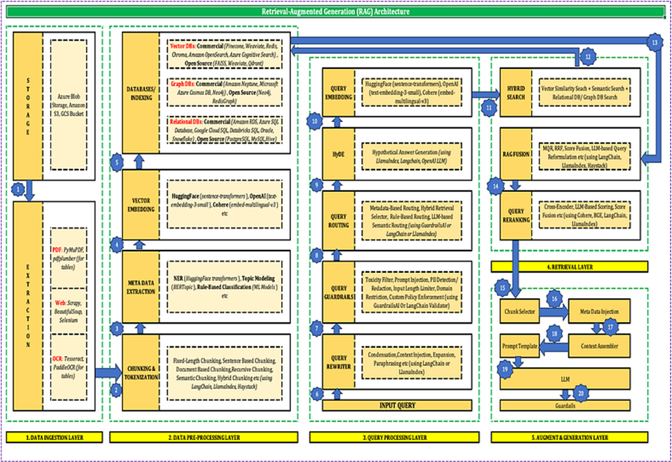
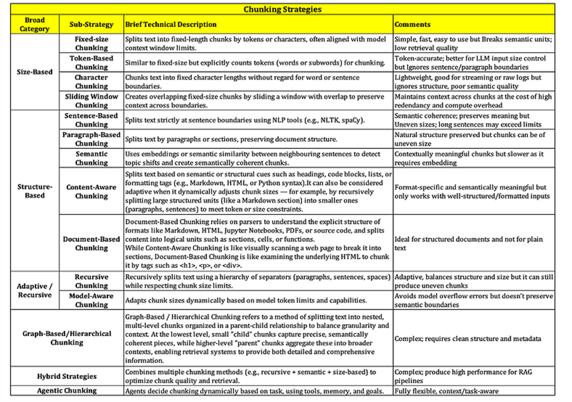
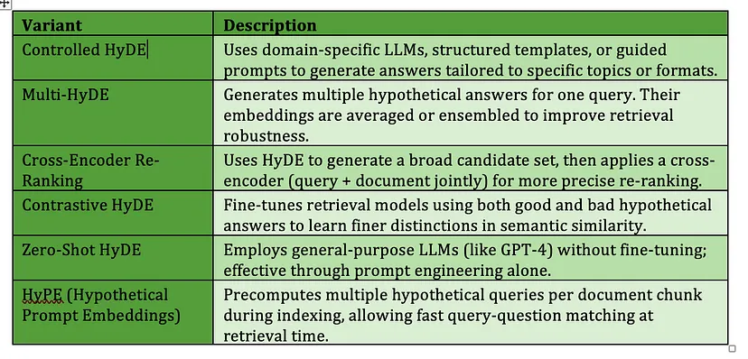
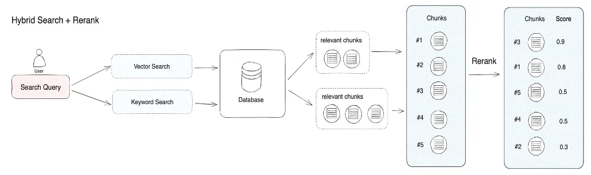
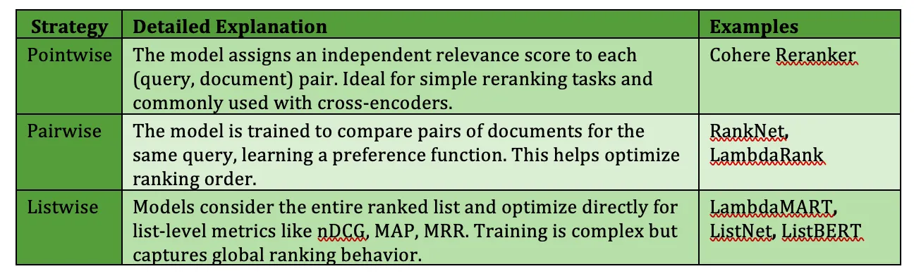
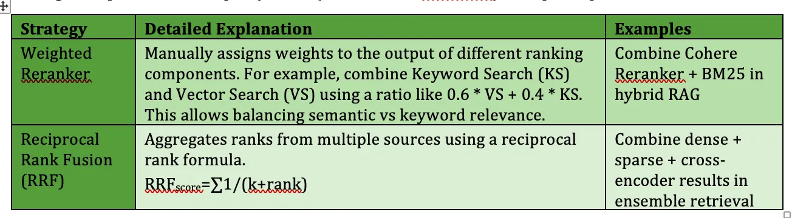
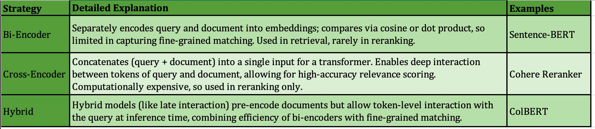
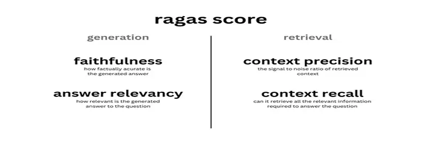
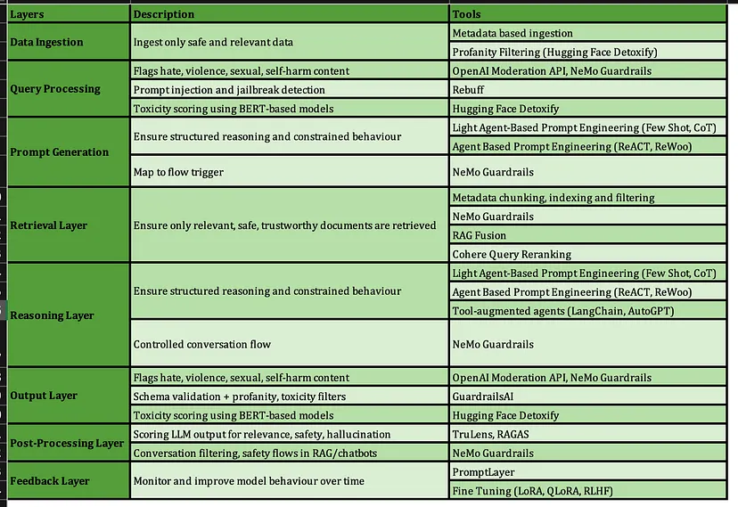

# Advanced RAG Architecture

## TDLR

Retrieval-Augmented Generation (RAG) is an AI architecture that combines document retrieval with language generation to provide context-aware answers. It operates by first converting internal documents into vector representations using a vector embedding model (e.g., OpenAI, HuggingFace) and storing these vectors in a vector store (e.g., FAISS, Chroma, Pinecone). At query time, the user’s question is also embedded using the same embedding model, and a similarity search is performed in the vector store to retrieve the top-k most relevant document chunks. These retrieved chunks are then augmented into the prompt of a large language model (LLM), which generates a final answer grounded in the retrieved context. Essentially, RAG is about giving additional relevant information (context) to large language models (LLMs) along with a query to help them generate better and relevant responses

## Why RAG?

1. It is important to note that if the documents themselves contain direct answers to the query, and there is no need for synthesis or language generation, then using only embedding-based retrieval with similarity search may be sufficient. However, if the goal is to produce contextualized, fluent, or synthesized responses, especially when the answer must be drawn from multiple documents or expressed naturally, RAG is the more appropriate choice.
2. There are few limitations of typical LLMs (etc. GPT, LLAMA):

   a) Since LLMs are trained on static datasets with a fixed training window, they are unable to incorporate information beyond their training cut-off. This leads to no response due to knowledge cut-off or outdated responses for time-sensitive queries.

   b) LLMs are designed to predict the next token, not to verify facts. As a result, they often Hallucinate (confidently generate plausible but incorrect or fabricated answer), Struggle with multi-step logical reasoning and perform poorly on domain-specific queries unless fine-tuned or augmented with external knowledge.
   RAG addresses these limitations by dynamically retrieving relevant, up-to-date, and domain-specific information from external data sources at inference time, which is then used to ground the LLM’s response. This reduces hallucination, mitigates knowledge cut-offs, and improves performance on complex or specialized queries without retraining the model.

## Architecture

Layers of RAG Architecture is shown below:

Now we will be discussing various techiquues of advanced RAG architecture one by one.

### Chunking

Chunking is one of the techniques in indexing.
Chunking serves multiple purposes in RAG:

- Efficiency: Smaller chunks reduce computational overhead during retrieval.
- Relevance: Precise chunks increase the likelihood of retrieving relevant information.
- Context Preservation: Proper chunking maintains the integrity of the information, ensuring coherent responses.

However, inappropriate chunking can lead to:

- Loss of Context: Breaking information at arbitrary points can disrupt meaning.
- Redundancy: Overlapping chunks may introduce repetitive information.
- Inconsistency: Variable chunk sizes can complicate retrieval and indexing.

**Chunking Strategy**

### HyDE

Chunks can be enriched with metadata information such as page number, file name, author,category timestamp.
HyDE (Hypothetical Document Embeddings) is a technique in Retrieval-Augmented Generation (RAG) that improves document retrieval by generating a hypothetical answer to the user’s query using a large language model (LLM) like GPT-3 or ChatGPT. Instead of embedding the original query, HyDE embeds this generated answer, which is semantically richer, and uses it to perform vector search. This enables answer-to-answer embedding similarity, which is often more effective than direct query-to-answer matching — especially when queries are vague or under-specified and the document corpus is dense and context-rich.

a) **Hypothetical Document Generation**: An LLM is prompted with the query to generate a plausible answer, even if it’s not factually accurate or found in the corpus. This synthetic answer reflects what an ideal response could look like and adds semantic depth to the query.

b) **Embedding**: The generated answer is embedded using a dense encoder (e.g., OpenAI Embeddings, Sentence Transformers). These encoders are typically trained via contrastive learning, which brings semantically similar texts closer and dissimilar text apart in vector space without labeled supervision. Concatenating the original query with the hypothetical answer before embedding to retain user intent will bring enhancement to the process.

c) **Retrieval**: The resulting embedding is used to search the vector database (e.g., FAISS, Pinecone) for semantically similar documents. Hybrid Search (combining vector similarity with lexical methods like BM25) can further improve performance.

When injecting retrieved documents into an LLM, placing the most relevant passages last in the prompt can increase their influence due to transformer recency bias. This is called Reverse Packing. There are few variants of HyDE.

### RAG Fusion

RAG Fusion extends standard RAG by generating multiple queries similar to the user’s original query, retrieving relevant documents for each query, and then combining and reranking these retrieved documents to construct a richer context for the generative model. By fusing information from multiple queries and retrieval strategies, RAG Fusion helps the model deliver more detailed and consistent responses. However, RAG Fusion adds computational overhead due to multiple retrieval and ranking steps, which may impact performance and infrastructure requirements. Following are the steps of RAG Fusion:

1. **Multi-Query Generation**: RAG Fusion begins by generating multiple derivative or sub-queries from the original user query using a large language model. The LLM rewrites the original query in several different ways, capturing alternative phrasings, synonyms, or related concepts. This helps surface documents that might not match the original wording but are still relevant. The input query can be broken down into smaller, more specific sub-questions. Each sub-question targets a distinct aspect of the broader topic, ensuring that nuanced or multifaceted queries are thoroughly addressed.
2. **Multi-Method Retrieval**: For each query variation, multiple retrieval methods like Vector similarity search, Keyword-based search or hybrid search are employed to improve recall. This process is parallel so it increases the diversity and breadth of the retrieved information, reducing the risk of missing important context due to the limitations of a single query.
3. . **Result Aggregation and De-duplication**: The results from all retrievals across all sub-queries are aggregated into a single pool. Duplicate documents are removed to avoid redundancy in the final candidate set.
4. . **Reciprocal Rank Fusion (RRF)**: RRF is the core ranking fusion technique used in RAG Fusion. RRF aggregates the ranked lists of documents retrieved for each sub-query by assigning higher scores to documents that consistently appear near the top across multiple lists. The RRF score for a document is calculated as:

$$RRFscore=∑1/(k+rank)$$

where rank is the document’s position in a retrieval list and k is a small constant (commonly 60) to dampen the effect of lower-ranked documents.

5. **Advanced Neural Re-ranking**: After RRF, some implementations apply neural re-ranking models such as BERT-based cross-encoders or models like MonoT5 and Cohere Rerank. These models analyze query-document pairs in context to further refine the ranking by capturing semantic relevance and listwise context.

### Cohere Reranker

In RAG, the primary focus lies in conducting hybrid search (vector + keyword) to retrieve the top-k semantically or lexically similar results for a given query, which are then passed to the LLM to generate an answer. However, this approach has some inherent limitation:

a) When document corpus is stored within vector store using embeddings, it causes information loss, possibly omitting finer semantic details.

b) Large documents are split into small chunks, losing broader context during retrieval.

c) Vector search only returns top-k matches, possibly excluding better but lower-ranked document chunks.

d) Not all retrieved documents can be passed to the LLM due to token limits.

e) Overloading the LLM with many documents can degrade recall and precision.

A query re-ranker model is a type of model that takes the vector search documents and calculates a matching score for a given query and document pair. This score can then be utilized to rearrange vector search results, ensuring that the most relevant results are prioritized at the top of the list.

Re-ranking can be based of various strategies:

1. Score-Based Strategies (Learning-to-Rank Methods): These strategies define how a model learns to assign or compare relevance between query-document.
   
2. Fusion Strategies (Heuristic Reranking): These techniques are not learned, but combine or reweight outputs from multiple systems (retrievers or rerankers) to improve performance.
   
3. Architectural Strategies (Neural Models): These describe how the reranker represents and interacts with the query and document.
   

In a Cohere Reranker pipeline, the inputs are a user query and a list of top-k documents or chunks retrieved using hybrid search. The Reranker forms a (query, document) pair for each retrieved chunk. Cohere Reranker is a cross-encoder, meaning it processes the query and document together through a transformer model that captures deep interactions between them. For each pair, the model outputs a relevance score between 0 and 1, indicating how well the document matches the query. The model then reorders the documents based on these scores (from highest to lowest) and selects the top-n results (e.g., top 3), subject to the LLM’s context length constraints. These reranked and trimmed documents are then passed as context to an LLM (e.g., GPT-4) for final answer generation, improving accuracy and relevance.

### Model Evaluation Metrics & RAGAS Framework

1. ROUGE: ROUGE score is a recall-based score which essentially answers how much of the reference answer is captured by the RAG generated answer. ROUGE-1 measures how many individual words (unigrams) from the ground truth are present in the RAG generated answer. ROUGE-2 measures how many pairs of consecutive words (bigrams) from ground truth are present in RAG generated answer. ROUGE-L (Longest Common Subsequence) looks at the longest sequence of matching words in the ground truth that appear in RAG generated answer answers. ROUGE-L doesn’t need a fixed n-gram size because it automatically finds the longest matching sequence. This rewards fluency and structure.

2. BLUE: BLUE score is a precision driven score which essentially answers how much of the RAG generated answer is present in RAG generated answer based on n-gram overlap. BLUE consider two aspects before computing the final score. For each n-gram BLEU calculates:

   a) BLEU-1: unigram precision (single words)

   b) BLEU-2: bigram precision (two-word sequences)

   c) BLEU-3: trigram precision

   d) BLEU-4: up to 4-grams (most commonly used)

Brevity penalty penalizes RAG generated answer that are too short compared to the closest reference length with an exponential decay. The brevity penalty compensates for the fact that the BLEU score has no recall term. Usually, it has been observed that the BLEU score decreases as the sentence length increases.

While BLEU and ROUGE have been widely used in text generation evaluation, they come with significant limitations. Both require ground-truth reference answers to compare against, which are often unavailable in real-world RAG systems, where users ask open-ended, unpredictable questions and answers are generated dynamically. Additionally, BLEU and ROUGE rely on surface-level n-gram overlap, which makes them insensitive to paraphrasing, synonyms, or deeper semantic meaning. They also do not assess whether an answer is grounded in the retrieved context, making them unsuitable for evaluating hallucinations.

#### RAGAS Framework

In contrast, the RAGAS framework is more appropriate for production-grade QA systems where reference answers may be unavailable and hallucination detection is critical. RAGAS breaks down the RAG pipeline into two components: the retriever and the generator (LLM). The retriever is evaluated using context precision and context recall, which assess the quality and completeness of retrieved information. The generator is evaluated using faithfulness, which measures whether the answer is supported by the retrieved context, and answer relevancy, which measures how well the answer addresses the original question.

1. Context Recall: It measures how much of the information required to answer the question was actually retrieved. It evaluates the completeness of the retrieval step by comparing the retrieved context against what would be necessary to generate a correct answer. Scores range from 0 to 1, where higher values indicate more complete retrieval.
2. Context Precision: It measures the relevance of the retrieved context to the question. Specifically, it assesses the proportion of retrieved information that is actually useful for answering the question.
3. Faithfulness: It measures whether the generated answer is supported by the retrieved context. It detects hallucinations. If the model invents a fact not in the retrieved documents, the score goes down.
4. Answer Relevancy: It evaluates how well the answer addresses the question, regardless of context. If a relevant and correct answer is generated but not based on context, answer relevance may still be high so unlike faithfulness it is not penalizing for hallucination.

#### Guardrails

Guardrails are predefined set of policies, rules and controls to prevent LLMs from generating harmful, biased, off-topic, or otherwise undesirable content. Guardrails can be implemented at various layers of LLM or RAG.

